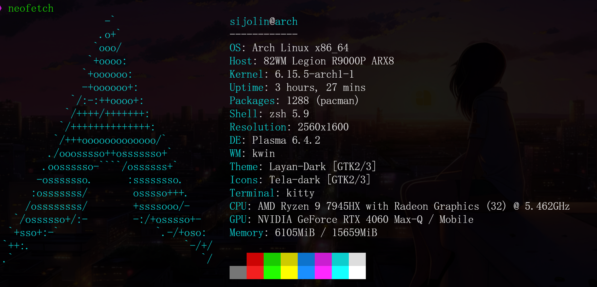
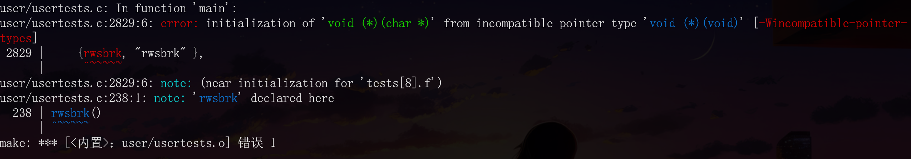
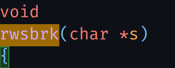

记录在配置MIT6.S081时所踩的坑。

系统为Archlinux物理机，环境如下：

学习的课程版本为[Fall 2021](https://pdos.csail.mit.edu/6.828/2021/schedule.html)，因为这一版本兼容新版本的 `qemu`，而2020版本不兼容，需要额外降级。

至于前置操作，已经有博主给出了详细的指导：[MIT 6.S081 lab0：配置xv6环境+vscode调试](https://acmicpc.top/2024/02/08/MIT-6.S081-lab0-%E9%85%8D%E7%8E%AF%E5%A2%83/#%E9%85%8D%E7%BD%AEVScode%E5%92%8Cclangd)，这里不再赘述。

但是我按照其步骤配置时，另外发现一个坑。即修改完 `runcmd`函数时再次运行 `make qemu`，出现以下报错：

解决方法是修改 `user/usertests.c`文件中的 `rwsbrk()`函数声明：

之后便可编译成功！
