对于Git和GitHub的配置和使用在此不再赘述，在互联网中能找到大量优秀的讲解。


## 创建 Github Pages仓库

在Github创建一个新的仓库：

- 名称设置为 `用户名.github.io`
- 勾选 “Initialize this repository with a README“

如图所示：

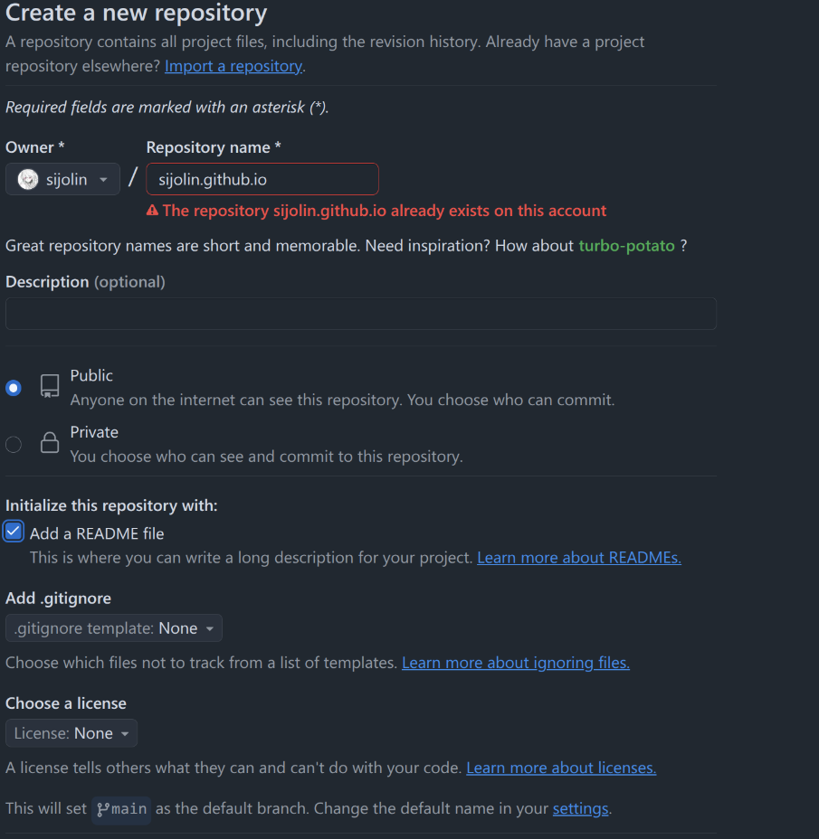


## 安装nodejs和Hexo

输入以下命令安装`Node.js`和`npm`：

```shell
# Ubuntu
sudo apt update
sudo apt install nodejs npm

# Arch
sudo pacman -S nodejs npm
```


通过` npm `全局安装 `Hexo`：

```shell
sudo npm install -g hexo-cli
hexo -v  # 检查 Hexo 版本
```


初始化 `Hexo `项目：

```shell
cd Blog # 转到博客根目录
hexo init
npm install # 安装依赖
```


之后便可以运行 `Hexo `的本地服务器：

```shell
hexo s
```

在浏览器地地址栏中输入 `http://localhost:4000`查看博客。


发布文章：

```shell
hexo new “文章标题”
```


也可以自己创建` .md `文件，在将其移入 `source/_posts`，但需要在文件开头手动添加文件属性：

```markdown
---
title: Hello World # 标题
date: 2019/3/26 hh:mm:ss # 发布时间
categories: # 分类
tags: # 标签
comments: #是否允许评论
---

摘要
<!--more-->
正文
```

其中 `<!--more-->`以上的文章是摘要，以下则是正文，效果如下：

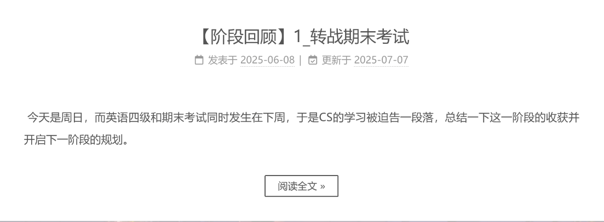


如果只是临时修改然后看看效果，或者排查错误，可以使用 

```shell
hexo s
```

其会立刻应用修改并呈现，如果有错误会在命令行中提示。


如果想将修改上传到服务器，让所有人都能看到，那么使用一键三连：

```shell
hexo clean
hexo g
hexo d
```


## 部署 Hexo 到 GitHub Pages

接下来需要将本地的博客部署到 GitHub，使其能够在网上访问。


安装 `hexo-deployer-git`：

```shell
npm install hexo-deployer-git --save
```


然后修改`_config.yml`文件的末尾部分：

```shell
# Deployment
## Docs: https://hexo.io/docs/one-command-deployment
deploy:
  type: git
  repository: git@github.com:sijolin/sijolin.github.io.git
  branch: main
```


其中`repository`的值替换成你自己的仓库地址。这里推荐使用SSH地址，因为HTTPS现在好像无法使用。另外如今的GitHub默认创建 main 分支，有些时间较早的教程使用的是 master。


这时候访问我们的 GitHub 域名 `https://用户名.github.io`便可以看到 Hexo 网站了。


## 域名绑定


上一步我们将本地博客部署到 Github的子域名，我们也可以将其部署到自己选择的域名，更加个性化。


这里使用[万网](https://www.aliyun.com/benefit?utm_content=se_1019887613)来购买和注册域名。

注册账号后一次在主页选择 产品 -> 域名与网站 -> 域名：

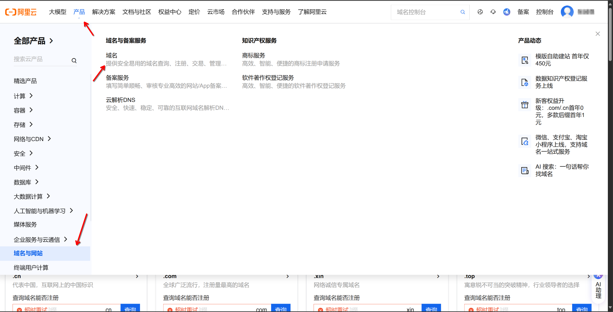

然后便可以查询和购买自己喜欢的域名。


之后还是在刚才查询域名的界面，进入域名控制台：

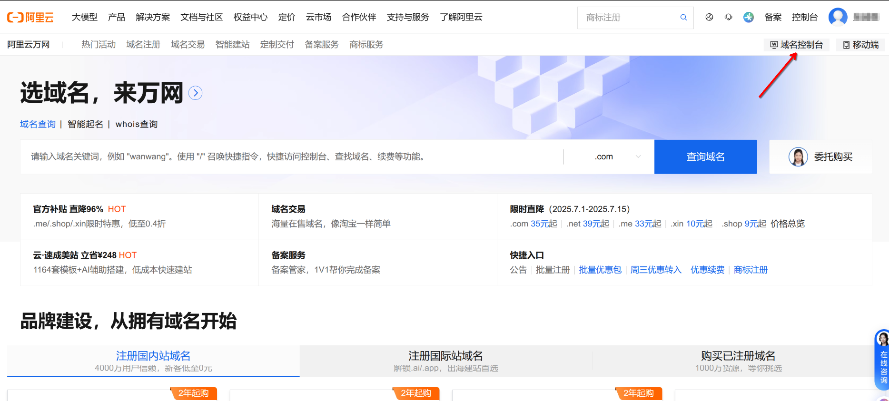


点击全部域名，然后点击解析操作：

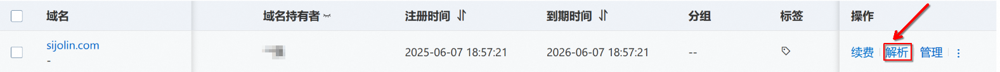


删除原有的默认记录，添加**下面两条（第一条不用添加）**解析记录：

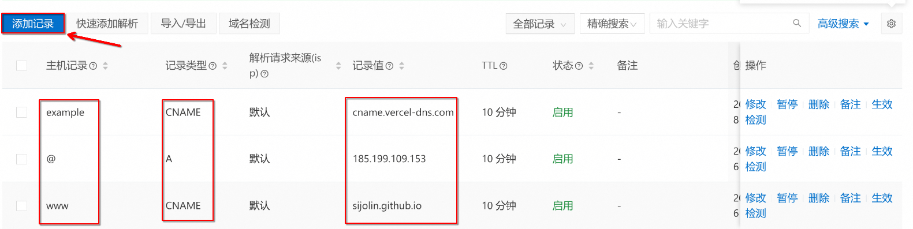


红框中的内容照着抄就行，需要修改的有两点：

1. 主机记录为 @ 的记录值：这个是IPV4地址，可以通过ping得到：打开终端输入

   ```shell
   ping sijolin.github.io # ping + 你的GitHub地址
   ```

2. 主机记录为 www 的记录值：填写你自己的GitHub地址。


> 这里主机记录为 example 的解析记录是为后面部署 Waline 评论系统准备的，在后面还会再叙述，这步可以省略。


然后进入博客文件夹的` source`，创建` CNAME `文件，并且输入域名：

```shell
touch CNAME
echo sijolin.com >> CNAME # 将域名输入到文件中
```


然后一键三连：

```shell
hexo clean
hexo g
hexo d
```


之后在GitHub仓库中的Setting界面检查一下：

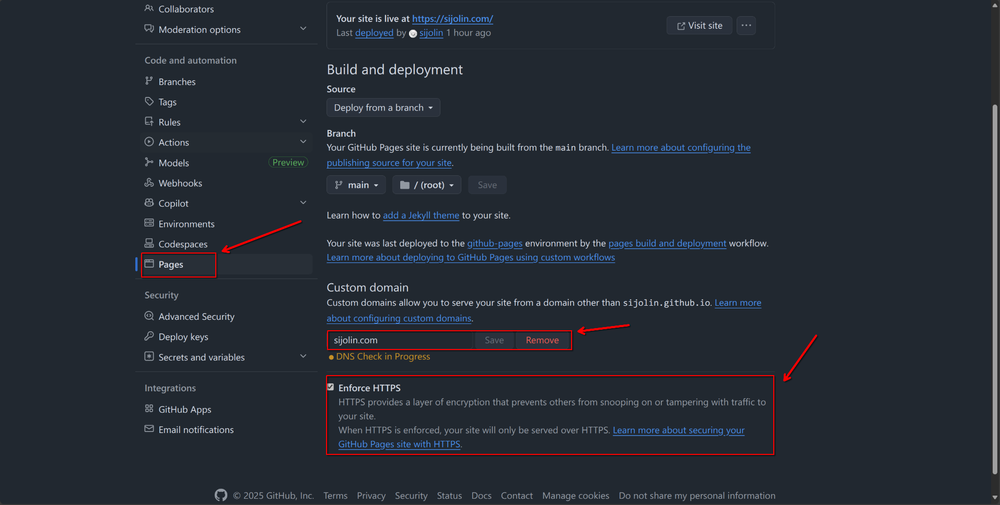


## 设置NexT主题

可以到[Themes | Hexo](https://hexo.io/themes/)挑选自己喜欢的主题，这里选择使用人数最多的[NexT](https://theme-next.js.org/docs/)主题。

在博客的**根目录**安装主题：

```shell
npm install hexo-theme-next
```


这里默认安装的是v7.8.0的版本，但是其不支持我们后面用到的Waline评论系统，因此需要将其升级到最新版本，打开**根目录**输入：

```shell
npm install hexo-theme-next@latest
```


完成后将主题配置文件复制到根目录下，其优先级更高，而且使用 `npm`升级的时候不会被覆盖或导致冲突，在**根目录下**输入：

```shell
cp node_modules/hexo-theme-next/_config.yml _config.next.yml
```


然后打开根目录的`_config.yml`，初始化自己信息和设置新主题：

```yaml
# Site
title: Sijolin's Blog
subtitle: ''
description: No regrets for past mistakes.
keywords:
author: Sijolin
language: zh-CN
timezone: Asia/Shanghai

# Extensions
## Plugins: https://hexo.io/plugins/
## Themes: https://hexo.io/themes/
theme: next
```


之后还可以在`_config.next.yml`文件中选择next主题（没错，next主题里还能选择主题），这里选择的是`Gemini`：

```yaml
# Schemes
#scheme: Muse
#scheme: Mist
#scheme: Pisces
scheme: Gemini
```


老规矩一键三连后，便可以看到新主题的博客了：

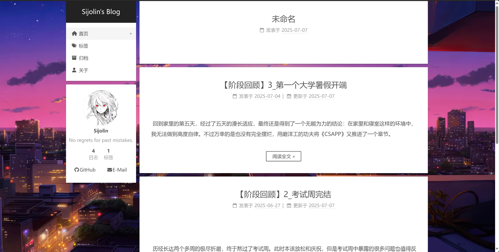


> 这里设置的背景和图片在下一步教程。


## 主题优化


### 设置菜单

打开主题配置文件`_config.next.yml`，查找`menu`，将对应项前面的注释符#删除就行：

```yaml
menu:
  home: / || fa fa-home                   # 首页
  categories: /categories/ || fa fa-th    # 分类
  tags: /tags/ || fa fa-tags              # 标签
  archives: /archives/ || fa fa-archive   # 归档
  about: /about/ || fa fa-user            # 关于
  #schedule: /schedule/ || fa fa-calendar # 日程
  #sitemap: /sitemap.xml || fa fa-sitemap # 网站地图
  #commonweal: /404/ || fa fa-heartbeat   # 慈善公益
```

其中`||`符号前面的是目录链接，后面的是图标名称，这里默认使用的是[图标库 - Font Awesome 中文网](https://link.zhihu.com/?target=http%3A//www.fontawesome.com.cn/faicons/%23web-application) 这一网站的。


在博客**根目录**中输入：

```shell
hexo new page "tags"
hexo new page "about"
hexo new page "categories"
```


会在根目录的`source`文件夹中生成`categories`、`tags`、`about`、`resources`四个文件夹，每个文件夹中有一个 `index.md`文件，分别修改其内容：

```markdown
---
title: 标签
date: 2025-06-07 21:54:28
type: "tags"
comments: false
---

---
title: 关于
date: 2025-06-07 21:54:28
type: "about"
comments: true
---


---
title: 分类
date: 2025-06-07 21:54:28
type: "categories"
comments: false
---
```


### 设置头像


打开主题配置文件 `_config.next.yml`，查找 `avatar`：

```yaml
# Sidebar Avatar
avatar:
  # Replace the default image and set the url here.
  url: /images/avatar.png 	# 图片的位置
  # If true, the avatar will be displayed in circle.
  rounded: true				# 圆形头像
  # If true, the avatar will be rotated with the cursor.
  rotated: false
```

然后将头像文件复制到 `node_modules/hexo-theme-next/source/images/`里，别忘了命名为 `avatar.png`（与`url`相对应）。


### 设置背景

先设置背景图片，将 `_config.next.yml`开头中取消对 `style`的注释：

```yaml
style: source/_data/styles.styl
```


然后在 `source`文件夹创建文件夹 `_data`，在 `_data`中创建文件 `styles.styl`，并输入内容：

```yaml
// 添加背景图片
body {
      background: url(/images/background.png);//自己喜欢的图片地址
      background-size: cover;
      background-repeat: no-repeat;
      background-attachment: fixed;
      background-position: 50% 50%;
}
```

同添加头像一样将自己喜欢的背景图片复制到 `node_modules/hexo-theme-next/source/images/`里，并将其重命名为 `background.png`（与`url`对应）。


接下来设置背景的动态效果，这里选择的是[Theme NexT Canvas Nest](https://github.com/theme-next/theme-next-canvas-nest)，由于其是动态背景，这里不做演示。

首先在 `source/_data`文件夹下创建 `footer.njk`文件，然后输入以下内容：

```yaml
<script color="0,0,255" opacity="0.5" zIndex="-1" count="99" src="https://cdn.jsdelivr.net/npm/canvas-nest.js@1/dist/canvas-nest.js"></script>
```


之后在 `_config.next.yml`的开头中取消对 `footer`的注释：

```yaml
footer: source/_data/footer.njk
```

一键三连后就能看见效果了。


### 添加顶部加载条

在**根目录**下使用终端命令：

```shell
git clone https://github.com/theme-next/theme-next-pace node_modules/hexo-theme-next/source/lib/pace
```


打开主题配置文件 `_config.next.yml`查找`pace`，作以下修改：

```yaml
pace:
  enable: true
  # All available colors:
  # black | blue | green | orange | pink | purple | red | silver | white | yellow
  color: purple
  # All available themes:
  # big-counter | bounce | barber-shop | center-atom | center-circle | center-radar | center-simple
  # corner-indicator | fill-left | flat-top | flash | loading-bar | mac-osx | material | minimal
  theme: minimal
```

其中 `color`和`theme`都可以用注释中的选项替换。


设置博文内链接为蓝色

打开 `node_modules/hexo-theme-next/source/css/_common/components/post/post-body.styl`文件，在其末尾添加代码：

```yaml
.post-body {
  // 其它内容 
  
  // 要添加的代码
  p a{
    color: #0593d3;
     border-bottom: none;
     &:hover {
       color: #0477ab;
       text-decoration: underline;
     }
  }
}
```


效果如下所示：

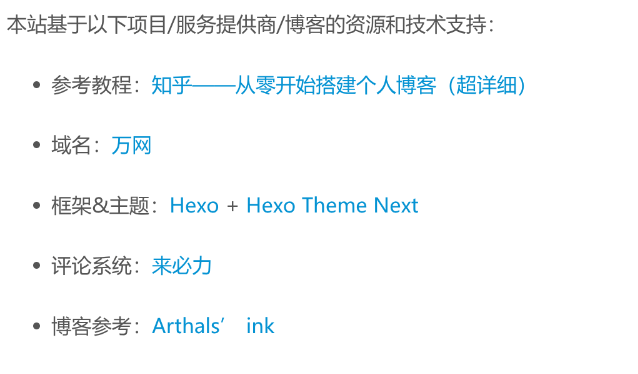


### 显示文章字数和阅读时长

在**根目录**执行以下命令来安装模块：

```shell
npm install hexo-word-counter
hexo clean
```


然后打开 `_config.yml`文件，查找 `symbols_count_time`，作出一下修改：

```yaml
symbols_count_time:
  symbols: true               # 文章字数统计
  time: true                  # 文章阅读时长
  total_symbols: true         # 网站总字数
  total_time: true            # 网站总阅读时长
  exclude_codeblock: false    # 排除代码字数统计
  wpm: 275                    # 默认每分钟阅读字数
  suffix: "mins."             # 文章阅读时长后缀
```


效果如下：

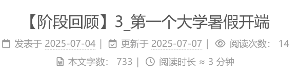


### 文章末尾添加版权说明

在 `_confit.next.yml`中查找 `creative_commons`，作出修改：

```yaml
creative_commons:
  # Available values: by | by-nc | by-nc-nd | by-nc-sa | by-nd | by-sa | cc-zero
  license: by-nc-sa
  # Available values: big | small
  size: small
  sidebar: false
  post: true # 显示版权信息
  # You can set a language value if you prefer a translated version of CC license, e.g. deed.zh
  # CC licenses are available in 39 languages, you can find the specific and correct abbreviation you need on https://creativecommons.org
  language:
```


效果如下所示：

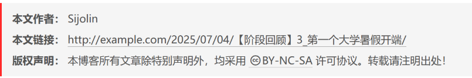


### 添加访问和阅读量统计

在 `node_modules/hexo-theme-next/layout/_third-party/analytics`目录下创建新文件 `busuanzi_counter.njk`，并输入以下代码：

```yaml

<div class="busuanzi-count">
  <script async src="https://busuanzi.ibruce.info/busuanzi/2.3/busuanzi.pure.mini.js"></script>

  
    <span id="busuanzi_container_site_uv" style='display:none'>
      {{ theme.busuanzi_count.site_uv_header }}
      <span id="busuanzi_value_site_uv"></span>
      {{ theme.busuanzi_count.site_uv_footer }}
    </span>
  

  
    <span id="busuanzi_container_site_pv" style='display:none'>
      {{ theme.busuanzi_count.site_pv_header }}
      <span id="busuanzi_value_site_pv"></span>
      {{ theme.busuanzi_count.site_pv_footer }}
    </span>
  

</div>

```


之后在 `_config.next.yml`文件中查找 `busuanzi_count`，启用该模块：

```yaml
busuanzi_count:
  enable: true
```


效果如下所示：

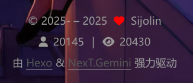


### 部署评论功能

这里采用的是 [Waline](https://waline.js.org/)评论系统，其可以支持匿名评论和登录评论，而且内容支持多种格式。

前置教程在 [快速上手](https://waline.js.org/guide/get-started/)中已经介绍的非常详细了，这里不再赘述，而是补充如何在 NexT 主题中部署该评论系统。


在**根目录**的终端中执行以下命令来下载评论插件：

```shell
npm install @waline/hexo-next
```

然后在 `_config.next.yml`中的 `Comments`部分加入以下模块：

```yaml
# Waline
# For more information: https://waline.js.org, https://github.com/walinejs/waline
waline:
  enable: true #是否开启
  serverURL: https://example.sijolin.com/ # Waline #服务端地址，我们这里就是上面部署的 Vercel 地址
  locale:
  	placeholder: 欢迎留下你的想法！ #评论框的默认文字
  avatar: mm # 头像风格
  meta: [nick, mail, link] # 自定义评论框上面的三个输入框的内容
  pageSize: 10 # 评论数量多少时显示分页
  lang: zh-cn # 语言, 可选值: en, zh-cn
  visitor: false # 文章阅读统计
  comment_count: true # 如果为 false , 评论数量只会在当前评论页面显示, 主页则不显示
  requiredFields: [nick] # 设置用户评论时必填的信息，[nick,mail]: [nick] | [nick, mail]
```

`serverURL`地址：`https://example.youdomain.com`


效果如下：

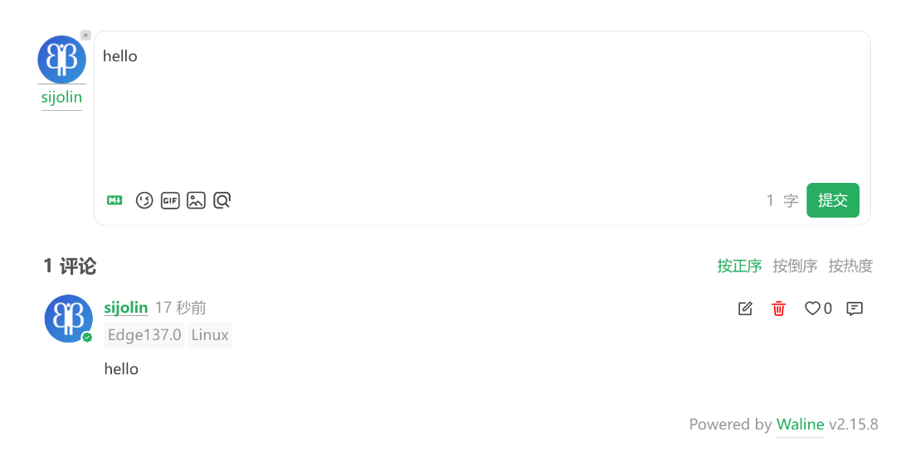


### 设置建站时间

查找 `_config.next.yml`中的 `since`，将日期修改为建站日期：

```yaml
footer:
  # Specify the year when the site was setup. If not defined, current year will be used.
  since: 2025-05
```


### 添加社交链接

查找 `_config.next.yml`中的 `social`，将要添加的选项取消注释：

```yaml
social:
  GitHub: https://github.com/sijolin || fab fa-github
  E-Mail: mailto:vty4190@qq.com || fa fa-envelope
  #Weibo: https://weibo.com/yourname || fab fa-weibo
  #Twitter: https://twitter.com/yourname || fab fa-twitter
  #FB Page: https://www.facebook.com/yourname || fab fa-facebook
  #StackOverflow: https://stackoverflow.com/yourname || fab fa-stack-overflow
  #YouTube: https://youtube.com/yourname || fab fa-youtube
  #Instagram: https://instagram.com/yourname || fab fa-instagram
  #Skype: skype:yourname?call|chat || fab fa-skype
```


### 在文章中插入图片

首先在**根目录**下使用命令安装插件 [hexo-renderer-marked](https://link.zhihu.com/?target=https%3A//github.com/hexojs/hexo-renderer-marked)：

```shell
npm install hexo-renderer-marked
```


之后在 `_config.yml` 中查找 `post_asset_folder` 并修改配置如下：

```yaml
post_asset_folder: true
marked:
  prependRoot: true
  postAsset: true
```


之后每次使用 `hexo new ` 创建文章时都会在 `source`目录创建与其同名的文件夹，用来存储此文章要插入的图片；当然也可以自己在该目录创建这个同名文件夹。


比如这篇文章命名为 “【折腾记录】1_搭建个人博客.md”，那么在我的 `source` 目录下存在同名文件夹：

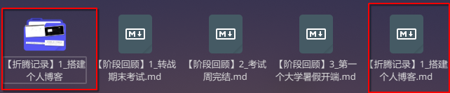

文件夹里存在照片 `1.png`，那么我在文章中便可以直接使用 `markdown`语法插入：

```markdown

```


### 文章目录配置

在 `_config.next.yml`中查找 `toc`，可以自定义配置目录的显示：

```yaml
toc:
  enable: true # 是否启用目录
  # Automatically add list number to toc.
  number: true # 是否为目录添加数字编号
  # If true, all words will placed on next lines if header width longer then sidebar width.
  wrap: false # 是否自动换行
  # If true, all level of TOC in a post will be displayed, rather than the activated part of it.
  expand_all: false # 是否展开所有层级
  # Maximum heading depth of generated toc.
  max_depth: 6 # 目录显示的最大标题层级
```


### 支持mathjax公式

在 `_config.next.yml`中查找 `mathjax`：

```shell
mathjax:
    enable: true
    # Available values: none | ams | all
    tags: none
```


### 博文置顶

在根目录输入以下命令：

```shell
npm uninstall hexo-generator-index --save
npm install hexo-generator-index-pin-top --save
```


在需要置顶的文章的 `Front-matter` 中加上 `top`标签：

```markdown
---
title: 【折腾记录】1_个人博客搭建记录
date: 2025-06-08 21:18
tags: Blog
categories: 折腾记录
top: true
---
```


可以选择设置置顶标志。打开 `node_modules/hexo-theme-next/layout/_partials/post/post-meta.njk` 文件，在开头加入以下代码：

```yaml
<div class="post-meta">
  
  

  // 要加入的代码
  
            <i class="fa fa-thumb-tack"></i>
            <font color=7D26CD>置顶</font>
            <span class="post-meta-divider">|</span>
          
  
  // 其它代码
 
```


效果如下：

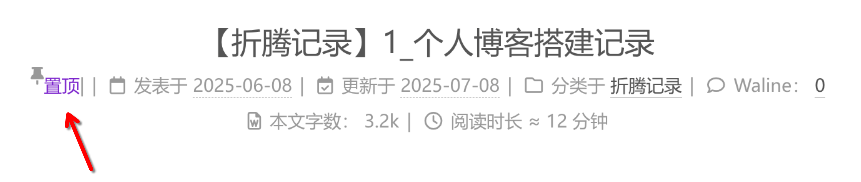


## 参考文章

- [Getting Started | NexT](https://theme-next.js.org/docs/getting-started/)

- [Hexo+NexT：添加Waline评论系统](https://martina-x.github.io/2024/06/20/Hexo-NexT%EF%BC%9A%E6%B7%BB%E5%8A%A0Waline%E8%AF%84%E8%AE%BA%E7%B3%BB%E7%BB%9F/)

- [MyBlog](https://www.zhihu.com/column/c_1201860091307458560)

- [Waline快速上手](https://waline.js.org/guide/get-started/)

- [hexo博客如何插入图片](https://zhuanlan.zhihu.com/p/265077468)

- [Hexo建站日记（一）——访客和阅读数统计](https://echowinde.github.io/2022/06/08/hexo-diary-1/)

  


