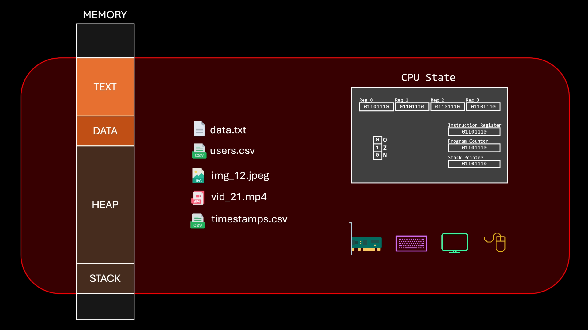
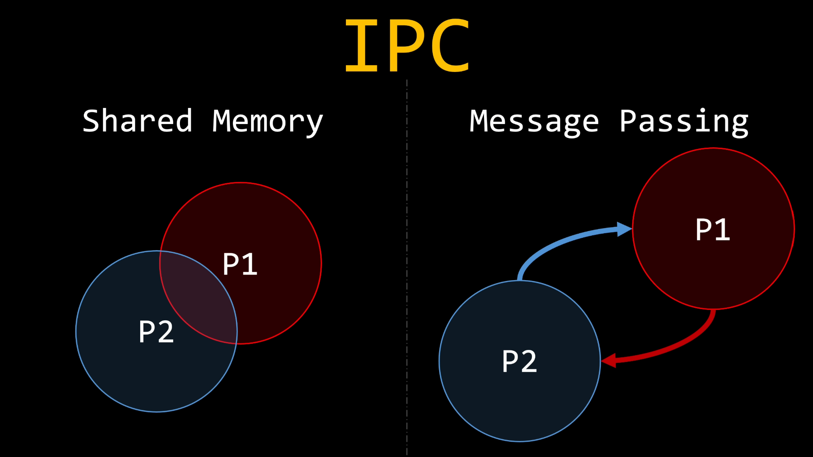
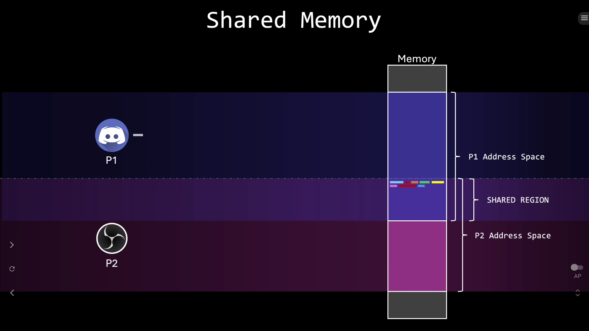
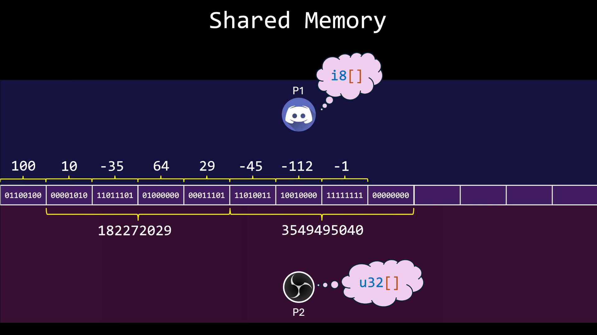
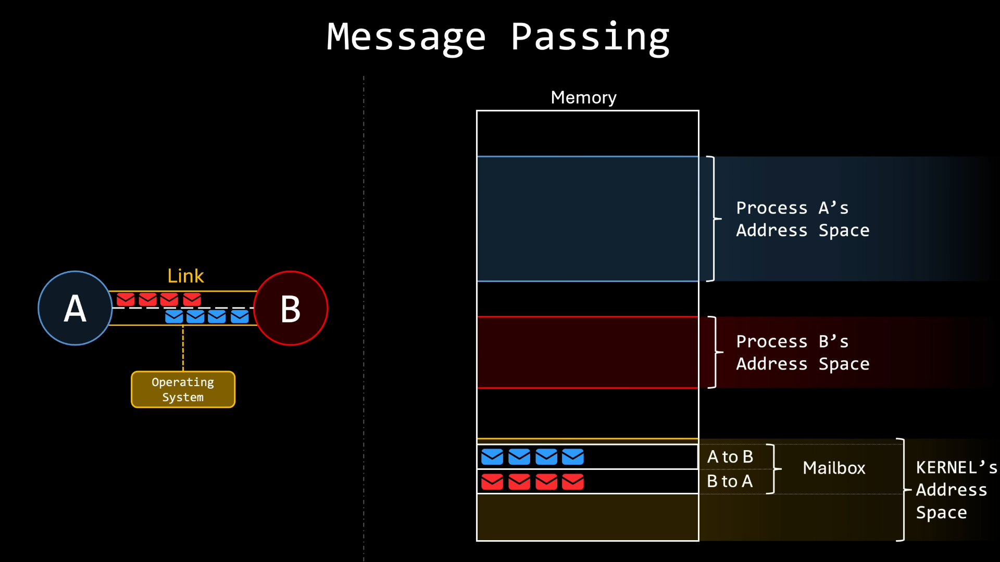
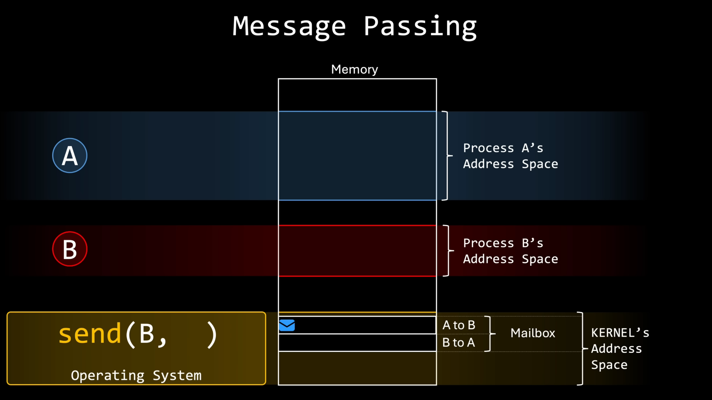
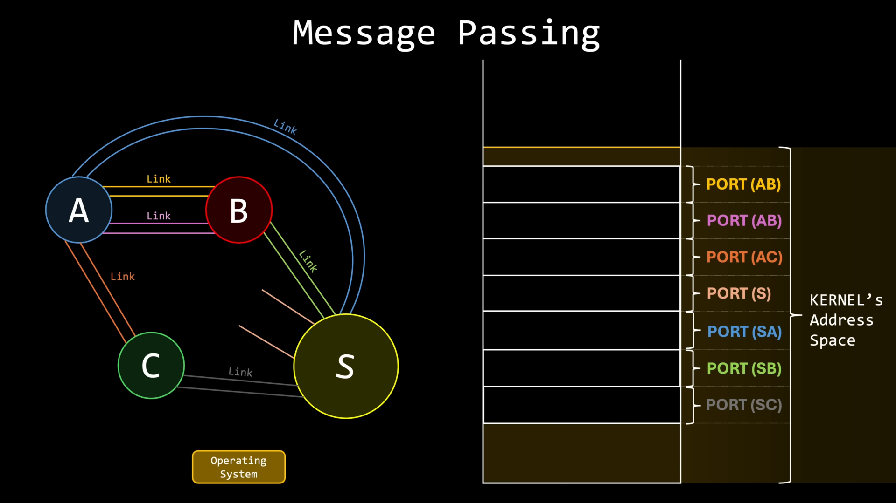
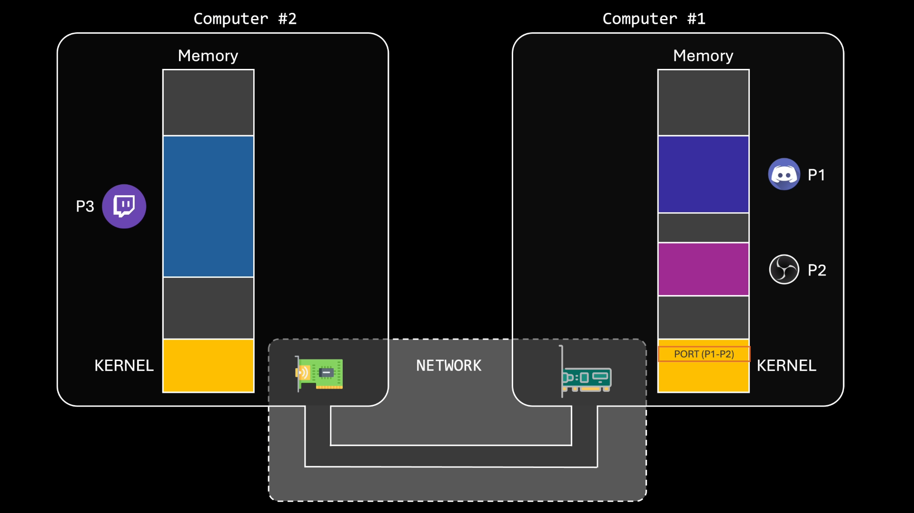

学习完 《CSAPP》的”异常控制流“章节后在偶然在油管上找到一个用动画讲解进程间通信的视频：[**IPC: To Share Memory Or To Send Messages**](https://www.youtube.com/watch?v=Y2mDwW2pMv4)，看了一遍感觉讲解得非常形象易懂，配合动画让我从视觉上对这些通信机制有了更直观的认识，便有了写此文的冲动。

<!--more-->

# 进程

当程序被加载到内存执行时，它就有了新名字——进程。

但进程不仅仅是加载到内存中的可执行代码，它还包括一个 CPU 状态，分配给进程的内存区域，打开的文件列表和其它资源，如 I/O 设备。因此，进程不仅仅是一个程序，它是程序运行的整个上下文。

进程间通信有两种基本模型：**共享内存和消息传递**。

# 共享内存

顾名思义，这种机制允许进程直接共享内存空间。
当系统上同时运行多个进程时，操作系统会为每个进程分配一个单独的内存块，这被称为**进程地址空间**。通过一种特权指令的机制，操作系统强制隔离，防止进程访问彼此的内存。如果有一个进程试图读取或写入另一个进程的地址空间，操作系统将立即中断并终止该进程，强制执行隔离策略以确保数据安全。
而当两个进程共享内存后，其可以通过写入和读取此共享区域进行通信。

存在一个重要细节：**一旦操作系统授予共享内存区域，它就不再管理此区域的操作**。即数据的结构大小以及写入数据的具体位置完全由进程决定。例如下图中对于相同的位采取不同的解释和读写方式，便会出现许多错误。
同时进程还要确保其不会同时写入同一位置，否则会遇到竞争条件（后期再讲）。

# 信息传递

信息传递可以保持地址空间隔离，进程之间通过发送消息进行通信，总体操作如下：
操作系统内核在其自己的地址空间中创建一个队列，该队列相当于中转站，用来存放要传递的信息。该队列称为**端口**。

需要阐明的一点是：**进程不能访问操作系统内核的地址空间**！
在这里进程其实是通过系统调用将信息保存在端口，操作系统提供两个系统调用：`send` 和 `receive`，其返回值便是端口中存放的信息。

另外，端口并不一定要与别的进程进行链接，其可以保持开放，用来监听来自其它进程的信息，其被称为**监听端口**（比如端口S）。监听端口用来处理被称为连接请求的特殊消息，以在进程之间建立新的连接。

采用信息传递的进程甚至不需要在同一台机器上，其可以通过网络链接进行信息传递。

# 其它资源

- B站的双语字幕（机翻）版本：[【双语视界】进程间通信之争：共享内存 vs 消息传递](https://www.bilibili.com/video/BV1xjGFzRESy/?spm_id_from=333.1007.top_right_bar_window_custom_collection.content.click&vd_source=74ec4f72a4bfcd8ce6aa18434e22e349)
